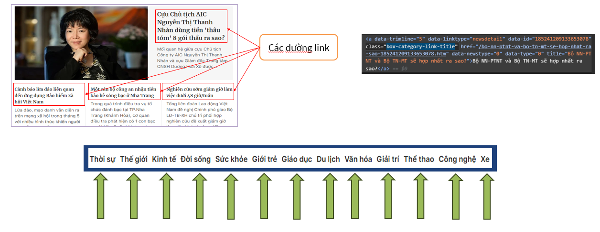
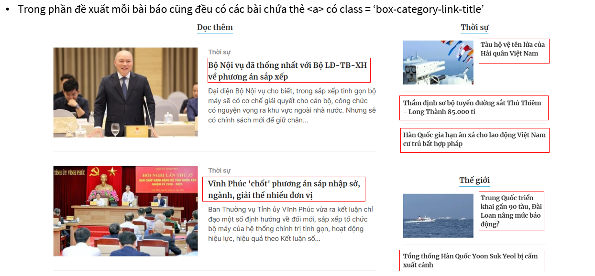
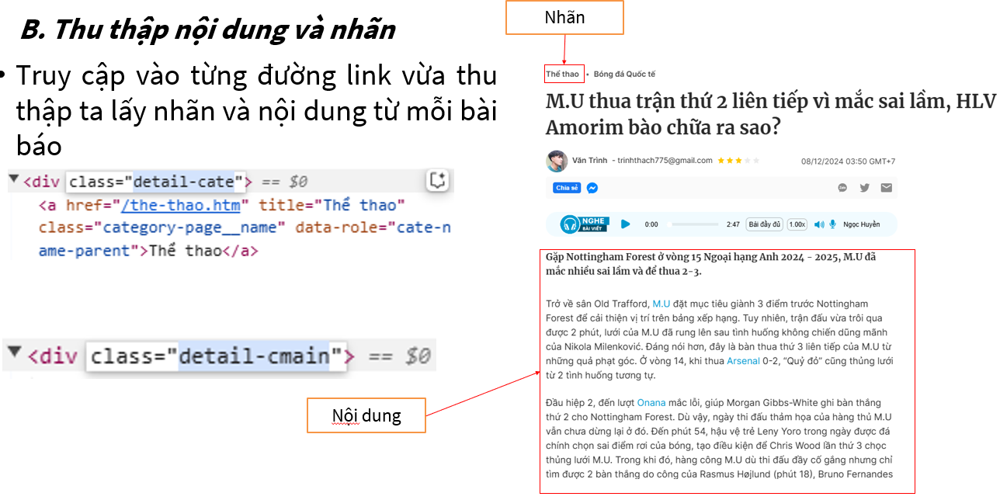
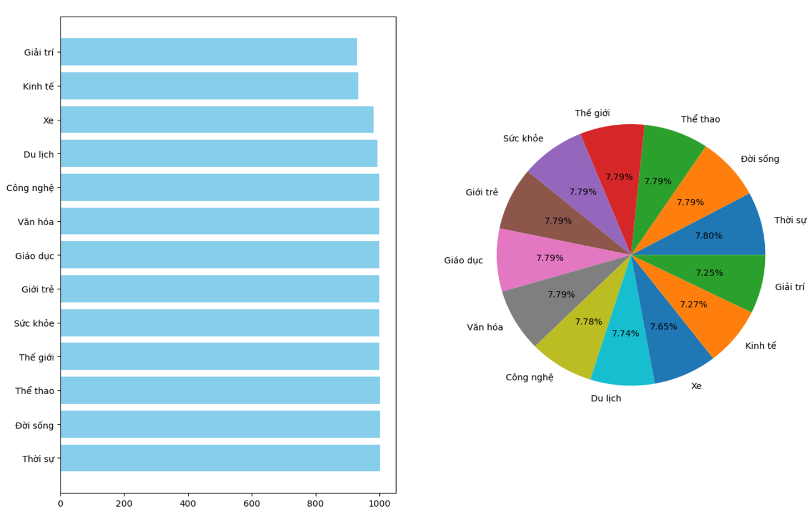
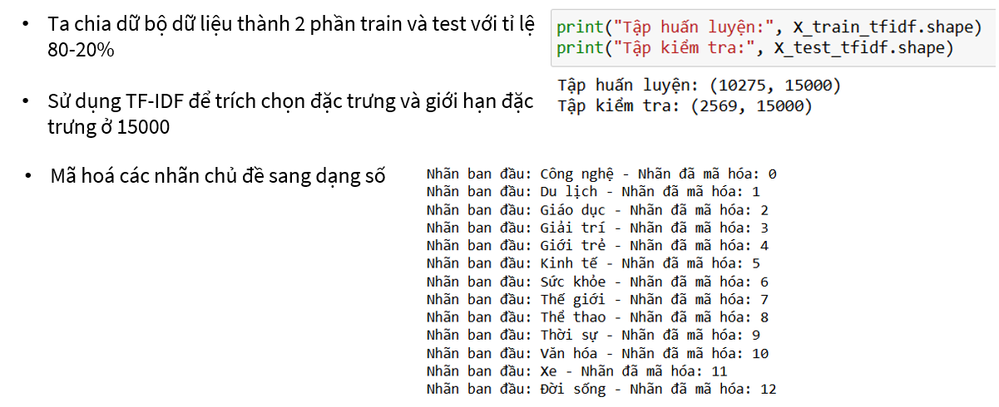
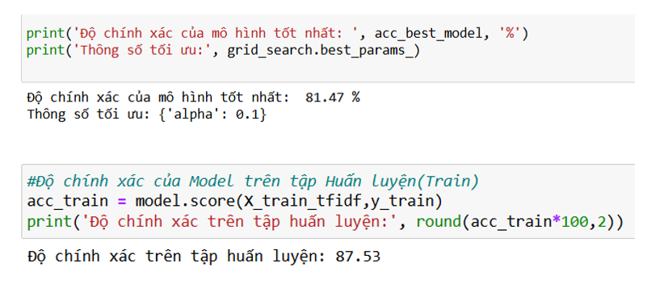
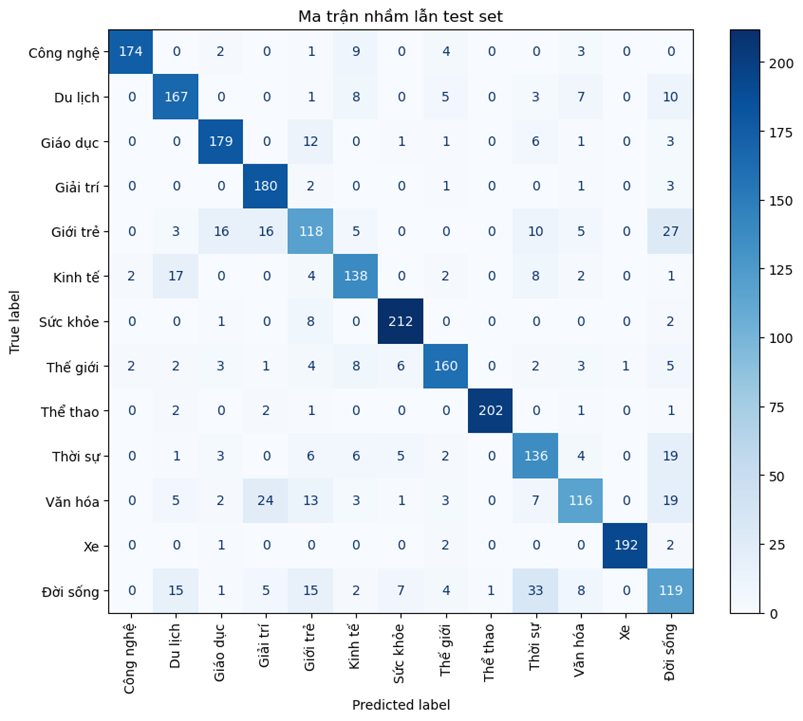
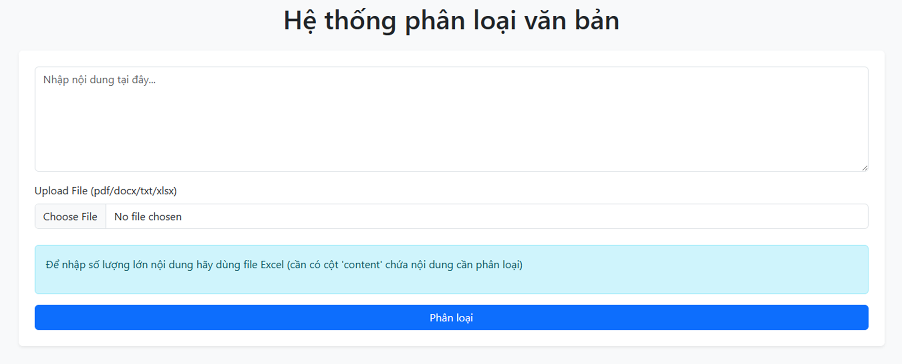

# 1.	Nghiên cứu và thu thập dữ liệu
-	Lấy danh sách link:
    - Để thực hiện bài toán phân loại văn bản này , cần thu thập một tập dữ liệu phong phú và đa dạng. Nguồn dữ liệu có thể từ các trang web, báo điện tử , diễn đàn, hoặc các kho dữ liệu mở. Ở đây tôi thu thập dữ liệu từ trang web : Tin tức 24h mới nhất, tin nhanh, tin nóng hàng ngày | Báo Thanh Niên (thanhnien.vn).
    - Bước đầu ta sử dụng thư viện requests để lấy được nội dung của các trang chủ của các danh mục và sử dụng thư viện BeautifulSoup để xử lý
    - Sau đó tìm các link ở hrel từ thẻ a có class = “box-category-link-title” và lưu lại. Sau đó truy cập vào các link và lặp lại các bước đến khi đủ số lượng link nhất định (Trong bài là 30000 link)
    
    
    
    

    - Do số lượng lớn nên ta sử dụng đa luồng để tối ưu về thời gian chạy
-	Lấy danh mục và nội dung:
    - Ta truy cập từng link đã lấy ở trên, sau đó ta lấy danh mục từ thẻ div có class = “detail-cate” và lấy nội dung từ thẻ div có class  = “detail-cmain”. Lặp lại các bước đến khi hết số lượng link hoặc các nhãn đủ số lượng.
    - Ta giới hạn số lượng bài viết mỗi danh mục(trong bài là 1000/1 danh mục) để dữ liệu được cân bằng

    

    - Do số lượng lớn nên ta cũng sử dụng đa luồng để tối ưu về thời gian chạy
# 2.	Xử lý dữ liệu
Dữ liệu thu thập cần phải qua nhiều bước xử lý để chuẩn bị cho việc xây dựng mô hình phân loại:
-	Chuyển đổi văn bản về dạng thống nhất : Chuyển về chữ thường, loại bỏ dấu câu , ký tự đặc biệt, xoá các dòng trống : Giúp đơn giản hóa văn bản
-	Tokenize : Tách văn bản thành từ hoặc cụm từ sau đó dùng từ điển loại bỏ từ dừng
-	Chia dữ liệu thành 2 phần train và test với tỉ lệ 80/20
-	Biểu diễn văn bản: Sử dụng kĩ thuật TF-IDF để chuyển văn bản sang vector.
-	Dùng LabelEncoder chuyển các nhãn danh mục sang dạng số

    

    

# 3.	Xây dựng mô hình và đánh giá độ chính xác
-	Sử dụng các mô hình học máy Naive bayes để phân loại văn bản. Các mô hình phổ biến bao gồm:
-	Để đánh giá hiệu quả của các mô hình, tôi sử dụng các chỉ số như độ chính xác (accuracy) , độ chính xác(precision), độ nhạy (recall) , và điểm F1 (F1- score). 
   
    

    

# 4.	Triển khai mô hình lên web
-	Tôi sử dụng thư viện flask để triển khai mô hình lên trang web
-	Website nhận đầu vào là văn bản nhập từ bàn phím hoặc các file Txt, docx, pdf, excel. Đầu ra là nhãn mà hệ thống dự đoán văn bản đó
    
    
